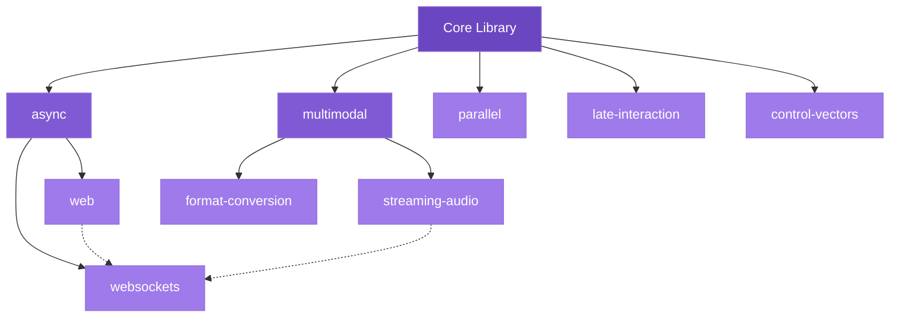

# Advanced Features

Mullama's advanced features unlock production capabilities for web services, real-time audio, parallel processing, and fine-grained retrieval. Each feature is independently gated behind Cargo feature flags.

!!! abstract "Prerequisites"
    Before exploring advanced features, ensure you are comfortable with:

    - [Loading models](../guide/models.md) and creating contexts
    - [Text generation](../guide/generation.md) and sampling parameters
    - [Async support](../guide/async.md) for non-blocking operations
    - [Streaming](../guide/streaming.md) for real-time token delivery

---

## Feature Dependency Diagram

Advanced features build on core capabilities. Some features transitively enable others:



**Key dependency chains:**

- `web` and `websockets` require `async` (Tokio runtime)
- `streaming-audio` and `format-conversion` require `multimodal`
- `parallel`, `late-interaction`, and `control-vectors` are standalone
- SIMD optimizations are always available (no feature flag needed)

---

## When to Use Advanced Features

| Feature | Use Case | Complexity |
|---------|----------|------------|
| [Web Framework](web-framework.md) | REST API server for LLM inference | Medium |
| [WebSockets](websockets.md) | Real-time chat, multi-user streaming | Medium |
| [Streaming Audio](streaming-audio.md) | Voice assistants, live transcription | High |
| [Format Conversion](format-conversion.md) | Audio/image preprocessing pipelines | Low |
| [Parallel Processing](parallel.md) | Batch inference, bulk embeddings | Medium |
| [Late Interaction](late-interaction.md) | High-precision semantic search (ColBERT) | Medium |
| [SIMD Optimizations](simd.md) | Faster sampling (automatic) | None |
| [Control Vectors](control-vectors.md) | Steering model behavior without fine-tuning | Low |

---

## Performance vs Complexity Tradeoffs

```
Performance Gain
    ^
    |                              * Parallel
    |                    * SIMD
    |           * Web         * Late Interaction
    |      * WebSockets
    |  * Format Conv    * Streaming Audio
    | * Control Vectors
    +-----------------------------------------> Complexity
      Low            Medium              High
```

!!! tip "Start Simple"
    Begin with the core library for prototyping. Add advanced features incrementally as your application requirements grow. Each feature flag increases compile time and binary size.

---

## Enabling Multiple Features

Combine features as needed in your `Cargo.toml`:

=== "Node.js"

    ```javascript
    // All advanced features are available through the Node.js binding
    const mullama = require('mullama');

    // Features are enabled at the native module level
    // No additional configuration needed
    ```

=== "Python"

    ```python
    # All advanced features are available through the Python binding
    import mullama

    # Features are enabled at the native module level
    # No additional configuration needed
    ```

=== "Rust"

    ```toml
    # Selective features
    [dependencies]
    mullama = { version = "0.1", features = ["web", "websockets", "parallel"] }

    # All features
    [dependencies]
    mullama = { version = "0.1", features = ["full"] }
    ```

=== "CLI"

    ```bash
    # Build with specific features
    cargo build --release --features "web,websockets,parallel"

    # Build with all features
    cargo build --release --features full
    ```

---

## Advanced Topics

<div class="grid cards" markdown>

-   **[Web Framework (Axum)](web-framework.md)**

    Build production REST APIs with routing, middleware, SSE streaming, and metrics.

-   **[WebSockets](websockets.md)**

    Real-time bidirectional communication with rooms, audio streaming, and compression.

-   **[Streaming Audio](streaming-audio.md)**

    Low-latency audio capture with voice activity detection and ring buffer architecture.

-   **[Format Conversion](format-conversion.md)**

    Convert between audio formats (WAV/MP3/FLAC) and image formats (JPEG/PNG/WebP).

-   **[Parallel Processing](parallel.md)**

    Rayon-powered batch inference with work-stealing, NUMA awareness, and CPU pinning.

-   **[Late Interaction (ColBERT)](late-interaction.md)**

    Per-token embeddings with MaxSim scoring for high-precision semantic retrieval.

-   **[SIMD Optimizations](simd.md)**

    Hardware-accelerated sampling with AVX2, AVX-512, and NEON support.

-   **[Control Vectors](control-vectors.md)**

    Steer model behavior (style, safety, personality) without fine-tuning.

</div>

---

## Feature Flags Reference

| Feature Flag | Dependencies | Description |
|-------------|-------------|-------------|
| `async` | tokio | Async/await support |
| `streaming` | - | TokenStream with backpressure |
| `multimodal` | - | Text, image, audio processing |
| `web` | `async` | Axum web framework integration |
| `websockets` | `async` | WebSocket server and client |
| `streaming-audio` | `multimodal` | Real-time audio capture |
| `format-conversion` | `multimodal` | Audio/image format conversion |
| `parallel` | rayon | Parallel batch processing |
| `late-interaction` | - | ColBERT-style multi-vector embeddings |
| `control-vectors` | - | Behavior steering vectors |
| `full` | all above | Enable everything |

---

## See Also

- [Library Guide](../guide/index.md) - Core library usage
- [API Reference](../api/index.md) - Complete API documentation
- [Examples](../examples/index.md) - Full working examples
