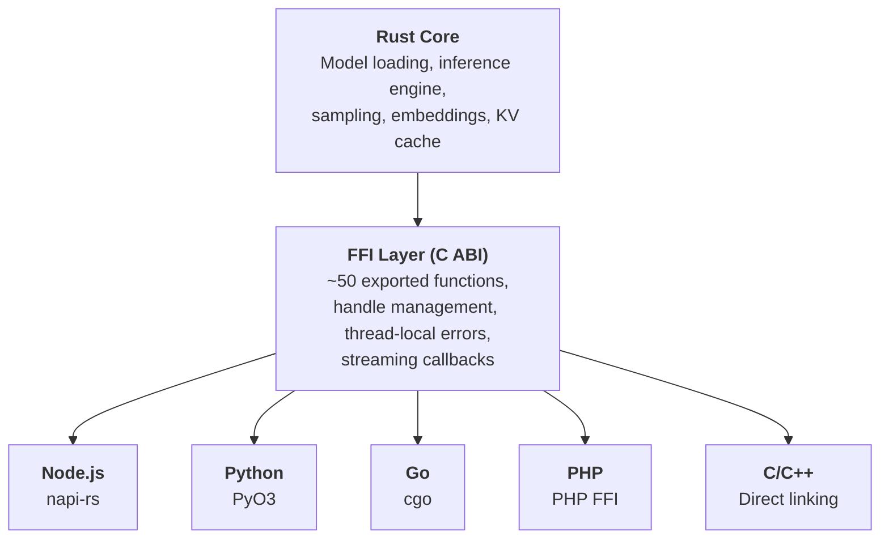

# Language Bindings

**This is Mullama's key differentiator: native LLM inference in 6 languages with near-zero overhead.**

!!! success "In-process. Zero IPC. Zero HTTP."
    Unlike Ollama (HTTP-only), Mullama bindings call directly into compiled Rust code. No serialization, no network calls, no separate process.

    **Result:** 100-1000x faster call initiation. Microseconds instead of milliseconds.

Mullama provides official bindings for **Node.js**, **Python**, **Go**, **PHP**, **Rust**, and **C/C++**. All bindings share the same high-performance Rust core through a stable C ABI.

## Architecture

All bindings share a common architecture that ensures consistent behavior and performance across languages:



```
+---------------------------------------------+
|            mullama (Rust core)               |
|  Model loading, inference, sampling,         |
|  embeddings, KV cache, tokenization         |
+----------------------+----------------------+
                       |
+----------------------+----------------------+
|           mullama-ffi (C ABI)               |
|  ~50 FFI functions, handle management,       |
|  thread-local errors, streaming callbacks   |
+------+------+------+------+-------+---------+
       |      |      |      |       |
   +---+--+ +-+---+ ++----+ +--+--+ +--+--+
   |napi-rs| | PyO3| |PHP   | | cgo | |  C  |
   |Node.js| |Python| |FFI  | | Go  | | C++ |
   +------+ +-----+ +-----+ +-----+ +-----+
```

The Rust core provides the model loading, inference engine, and sampling algorithms. The FFI layer exposes a stable C ABI with memory-safe handle management, thread-local error messages, and callback-based streaming. Each language binding wraps this C ABI using idiomatic patterns for that language.

!!! info "Near-Zero Overhead"
    All language bindings call directly into compiled Rust code through the C FFI layer. There is no serialization, no IPC, and no intermediate process. The only overhead is the function call boundary itself, which is negligible compared to the inference computation.

## Feature Comparison

| Feature | Node.js | Python | Go | PHP | C/C++ |
|---------|:-------:|:------:|:---:|:---:|:-----:|
| Model Loading | :material-check: | :material-check: | :material-check: | :material-check: | :material-check: |
| Text Generation | :material-check: | :material-check: | :material-check: | :material-check: | :material-check: |
| Streaming Generation | :material-check: | :material-check: | :material-check: | :material-minus: | :material-check: |
| Async Support | :material-check: | :material-minus: | :material-check: | :material-minus: | :material-minus: |
| Tokenization | :material-check: | :material-check: | :material-check: | :material-check: | :material-check: |
| Embeddings | :material-check: | :material-check: | :material-check: | :material-check: | :material-check: |
| Batch Embeddings | :material-check: | :material-check: | :material-check: | :material-check: | :material-check: |
| Chat Templates | :material-check: | :material-check: | :material-minus: | :material-minus: | :material-check: |
| Structured Output | :material-minus: | :material-minus: | :material-minus: | :material-minus: | :material-minus: |
| GPU Offload | :material-check: | :material-check: | :material-check: | :material-check: | :material-check: |
| Cosine Similarity | :material-check: | :material-check: | :material-check: | :material-check: | :material-check: |
| Cancellation | :material-minus: | :material-minus: | :material-minus: | :material-minus: | :material-check: |
| TypeScript Types | :material-check: | N/A | N/A | N/A | N/A |
| Type Stubs | N/A | :material-check: | N/A | N/A | N/A |

!!! note "Streaming in PHP"
    PHP's streaming support currently returns results as an array rather than providing real-time token callbacks. The C/C++ FFI layer does support true streaming via callbacks, but PHP FFI does not support callback functions.

## Platform Support

Pre-built binaries are available for the following platforms:

| Platform | Architecture | CPU | CUDA | Metal | Node.js | Python | Go | PHP | C/C++ |
|----------|:------------:|:---:|:----:|:-----:|:-------:|:------:|:---:|:---:|:-----:|
| Linux | x64 | :material-check: | :material-check: | - | :material-check: | :material-check: | :material-check: | :material-check: | :material-check: |
| Linux | ARM64 | :material-check: | - | - | :material-check: | :material-check: | :material-check: | :material-check: | :material-check: |
| macOS | x64 (Intel) | :material-check: | - | - | :material-check: | :material-check: | :material-check: | :material-check: | :material-check: |
| macOS | ARM64 (Apple Silicon) | :material-check: | - | :material-check: | :material-check: | :material-check: | :material-check: | :material-check: | :material-check: |
| Windows | x64 | :material-check: | :material-check: | - | :material-check: | :material-check: | :material-check: | :material-check: | :material-check: |

## Installation Summary

=== "Node.js"

    ```bash
    npm install mullama
    ```

    Requires Node.js >= 16. Pre-built native addons via napi-rs for all major platforms. TypeScript definitions included.

=== "Python"

    ```bash
    pip install mullama
    ```

    Requires Python >= 3.8. Pre-built wheels via PyO3 and maturin. NumPy integration for embeddings.

=== "Go"

    ```bash
    go get github.com/neul-labs/mullama-go
    ```

    Requires Go >= 1.21 and `CGO_ENABLED=1`. The `libmullama_ffi` shared library must be available at link time.

=== "PHP"

    ```bash
    composer require mullama/mullama
    ```

    Requires PHP >= 8.1 with the FFI extension enabled. Uses the pre-built `libmullama_ffi` shared library.

=== "C/C++"

    ```bash
    cargo build --release -p mullama-ffi
    ```

    Produces `libmullama_ffi.so` (Linux), `libmullama_ffi.dylib` (macOS), or `mullama_ffi.dll` (Windows) plus a generated `mullama.h` header file.

## Common API Patterns

All bindings follow a consistent pattern regardless of language. Here is the same operation shown across all supported languages:

### 1. Load a Model

=== "Node.js"

    ```javascript
    const { JsModel } = require('mullama');
    const model = JsModel.load('./model.gguf', { nGpuLayers: 32 });
    ```

=== "Python"

    ```python
    from mullama import Model
    model = Model.load('./model.gguf', n_gpu_layers=32)
    ```

=== "Go"

    ```go
    model, err := mullama.LoadModel("./model.gguf", &mullama.ModelParams{NGPULayers: 32})
    if err != nil { log.Fatal(err) }
    defer model.Free()
    ```

=== "PHP"

    ```php
    $model = Model::load('./model.gguf', ['nGpuLayers' => 32]);
    ```

=== "C"

    ```c
    MullamaMullamaModelParams params = mullama_model_default_params();
    params.n_gpu_layers = 32;
    MullamaMullamaModel* model = mullama_model_load("./model.gguf", &params);
    ```

### 2. Create a Context

=== "Node.js"

    ```javascript
    const { JsContext } = require('mullama');
    const ctx = new JsContext(model, { nCtx: 2048 });
    ```

=== "Python"

    ```python
    from mullama import Context
    ctx = Context(model, n_ctx=2048)
    ```

=== "Go"

    ```go
    ctx, err := mullama.NewContext(model, &mullama.ContextParams{NCtx: 2048})
    if err != nil { log.Fatal(err) }
    defer ctx.Free()
    ```

=== "PHP"

    ```php
    $ctx = new Context($model, ['nCtx' => 2048]);
    ```

=== "C"

    ```c
    MullamaMullamaContextParams ctx_params = mullama_context_default_params();
    ctx_params.n_ctx = 2048;
    MullamaMullamaContext* ctx = mullama_context_new(model, &ctx_params);
    ```

### 3. Generate Text

=== "Node.js"

    ```javascript
    const { samplerParamsGreedy } = require('mullama');
    const text = ctx.generate('Hello, AI!', 100, samplerParamsGreedy());
    ```

=== "Python"

    ```python
    from mullama import SamplerParams
    text = ctx.generate('Hello, AI!', max_tokens=100, params=SamplerParams.greedy())
    ```

=== "Go"

    ```go
    params := mullama.GreedySamplerParams()
    text, err := ctx.Generate("Hello, AI!", 100, &params)
    ```

=== "PHP"

    ```php
    $text = $ctx->generate('Hello, AI!', 100, SamplerParams::greedy());
    ```

=== "C"

    ```c
    MullamaMullamaSamplerParams params = mullama_sampler_greedy_params();
    int tokens[512];
    int n = mullama_tokenize(model, "Hello, AI!", tokens, 512, true, false);
    char output[4096];
    mullama_generate(ctx, tokens, n, 100, &params, output, sizeof(output));
    ```

### 4. Generate Embeddings

=== "Node.js"

    ```javascript
    const { JsEmbeddingGenerator, cosineSimilarity } = require('mullama');
    const gen = new JsEmbeddingGenerator(model);
    const emb = gen.embed('Hello, world!');
    ```

=== "Python"

    ```python
    from mullama import EmbeddingGenerator
    gen = EmbeddingGenerator(model)
    emb = gen.embed('Hello, world!')  # Returns numpy array
    ```

=== "Go"

    ```go
    eg, err := mullama.NewEmbeddingGenerator(model, 512, true)
    if err != nil { log.Fatal(err) }
    defer eg.Free()
    emb, err := eg.Embed("Hello, world!")
    ```

=== "PHP"

    ```php
    $gen = new EmbeddingGenerator($model);
    $emb = $gen->embed('Hello, world!');
    ```

=== "C"

    ```c
    MullamaMullamaEmbeddingConfig config = mullama_embedding_default_config();
    MullamaMullamaEmbeddingGenerator* gen = mullama_embedding_generator_new(model, &config);
    float embedding[4096];
    mullama_embed_text(gen, "Hello, world!", embedding, 4096);
    ```

## Sampler Presets

All bindings provide the same four sampler presets for consistent behavior across languages. These presets cover common use cases without requiring manual tuning of sampling parameters:

| Preset | Temperature | Top-K | Top-P | Min-P | Repeat Penalty | Use Case |
|--------|:-----------:|:-----:|:-----:|:-----:|:--------------:|----------|
| `greedy` | 0.0 | 1 | 1.0 | 0.0 | 1.0 | Deterministic, factual output |
| `precise` | 0.3 | 20 | 0.8 | 0.05 | 1.1 | Focused, low-variance responses |
| `default` | 0.8 | 40 | 0.95 | 0.05 | 1.1 | Balanced generation |
| `creative` | 1.2 | 100 | 0.95 | 0.0 | 1.0 | Creative writing, brainstorming |

!!! tip "Choosing a Preset"
    - Use **greedy** for tasks with a single correct answer (math, code completion, factual Q&A).
    - Use **precise** for structured tasks that benefit from slight variation (summaries, translations).
    - Use **default** for general-purpose generation (chatbots, assistants).
    - Use **creative** for open-ended tasks (story writing, brainstorming, poetry).

## Building from Source

All bindings can be built from source. Prerequisites:

1. **Rust toolchain** (1.75+)
2. **System dependencies** (see [Platform Setup](../getting-started/platform-setup.md))
3. **Language-specific tools** (listed below)

```bash
# Build the FFI shared library (required by Go, PHP, and C/C++)
cargo build --release -p mullama-ffi

# Build Node.js native module
cd bindings/node && npm install && npm run build

# Build Python wheel
cd bindings/python && pip install maturin && maturin build --release

# Build Go bindings (compilation check)
cd bindings/go && CGO_ENABLED=1 go build ./...

# Run PHP tests
cd bindings/php && composer install && composer test
```

| Language | Build Tool | Build Command |
|----------|-----------|---------------|
| Node.js | napi-rs, @napi-rs/cli | `npm run build` |
| Python | PyO3, maturin | `maturin build --release` |
| Go | cgo | `go build ./...` |
| PHP | Composer | `composer install` |
| C/C++ | Cargo | `cargo build --release -p mullama-ffi` |

## Performance Notes

All bindings achieve near-native performance because they call directly into compiled Rust code:

- **No serialization** -- data is passed through the C ABI as raw pointers and primitive types.
- **No IPC** -- everything runs in-process, in the same address space.
- **No intermediate runtime** -- the FFI layer is a thin C wrapper around Rust functions.
- **Zero-copy where possible** -- embeddings and token arrays are returned as direct memory views when the language supports it (e.g., NumPy arrays in Python).

The primary performance factors are:

1. **GPU offloading** -- set GPU layers to -1 for maximum throughput.
2. **Batch size** -- larger batches improve prompt processing speed.
3. **Context size** -- smaller contexts use less memory and can be faster.
4. **Model quantization** -- use Q4_K_M or Q5_K_M for the best speed/quality balance.

## Next Steps

Choose the binding for your language:

<div class="grid cards" markdown>

- :simple-nodedotjs: **[Node.js](nodejs.md)**

    ---

    High-performance bindings via napi-rs with full TypeScript support, async patterns, and framework integrations for Express, Fastify, and Next.js.

- :simple-python: **[Python](python.md)**

    ---

    PyO3-based bindings with NumPy integration for embeddings, type stubs, and framework integrations for FastAPI, Flask, and Django.

- :simple-go: **[Go](go.md)**

    ---

    cgo-based bindings with idiomatic Go error handling, goroutine-safe model sharing, and net/http server examples.

- :simple-php: **[PHP](php.md)**

    ---

    FFI-based bindings for PHP 8.1+ with Laravel and Symfony integrations and Composer distribution.

- :simple-cplusplus: **[C/C++](c-cpp.md)**

    ---

    Direct FFI layer access with complete API reference, RAII wrappers for C++, CMake integration, and cancellation support.

</div>
