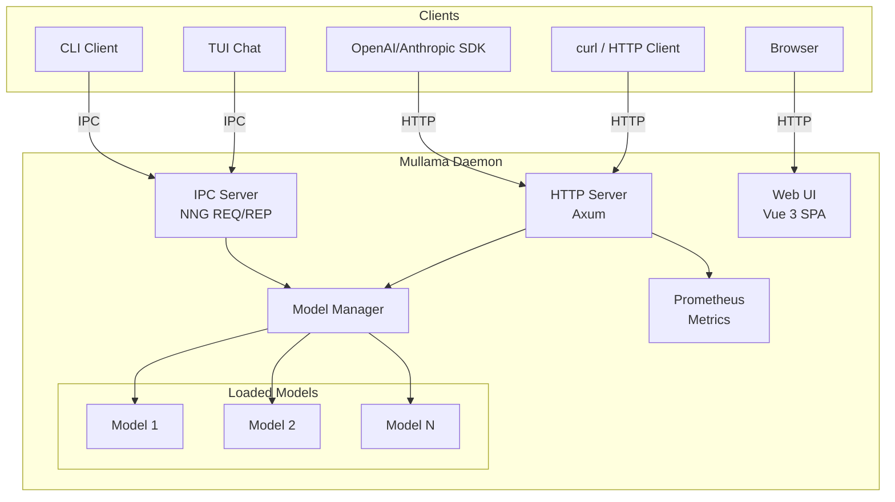

# Daemon & CLI

Mullama is a **library-first** LLM toolkit. You can embed it directly in your application with [native bindings](../bindings/index.md) for Python, Node.js, Go, PHP, Rust, and C/C++ -- no server required, no HTTP overhead.

**When you need a server**, Mullama includes a full-featured daemon with OpenAI and Anthropic-compatible APIs, a Web UI, TUI chat, and CLI tools.

!!! tip "Coming from Ollama?"
    The daemon works just like Ollama: same CLI commands (`run`, `pull`, `serve`, `list`), same Modelfile format, same GGUF models. Just replace `ollama` with `mullama`.

    **What you gain:** Native language bindings, Anthropic API, Web UI, TUI, ColBERT embeddings, and the option to embed directly in your app with zero HTTP overhead.

---

## Library vs Daemon: When to Use Each

| Use Case | Recommended | Why |
|----------|-------------|-----|
| High-frequency inference | **Library** | Direct function calls (microseconds vs milliseconds) |
| Embedding in your app | **Library** | No separate process, no IPC overhead |
| Multiple clients / languages | **Daemon** | Shared server, OpenAI SDK compatibility |
| Development / testing | **Daemon** | Quick iteration with CLI and Web UI |
| Ollama replacement | **Daemon** | Identical CLI commands |
| Production API server | **Daemon** | REST API, monitoring, multi-model |

---

## What the Daemon Provides

The Mullama daemon is a high-performance, multi-model LLM server with multiple client interfaces. It manages model lifecycles, serves OpenAI and Anthropic-compatible APIs, and offers a Web UI and TUI for interactive use.

## What the Daemon Provides

- **Multi-Model Server** -- Load and serve multiple GGUF models simultaneously with independent configurations
- **REST API** -- Management, monitoring, and generation endpoints over HTTP
- **OpenAI-Compatible API** -- Drop-in replacement for `/v1/chat/completions`, `/v1/completions`, `/v1/embeddings`, `/v1/models`
- **Anthropic-Compatible API** -- Messages API at `/v1/messages` with full streaming support
- **IPC Communication** -- High-performance local communication via NNG sockets for CLI and TUI
- **Embedded Web UI** -- Vue 3 + Vite + Tailwind CSS management interface with chat, models, playground, and monitoring
- **TUI Chat** -- ratatui-based terminal interface with multi-model switching and streaming output
- **Auto-Spawn** -- Transparent daemon lifecycle management; CLI commands start the daemon automatically
- **Model Registry** -- 40+ pre-configured aliases for HuggingFace models (e.g., `llama3.2:1b`, `qwen2.5:7b`, `deepseek-r1:7b`)
- **Modelfile Format** -- Ollama-compatible model configuration with extended directives (GPU_LAYERS, FLASH_ATTENTION, ADAPTER, etc.)
- **HuggingFace Integration** -- Direct model downloading with `hf:org/repo:file.gguf` format
- **Prometheus Metrics** -- Production monitoring at `/metrics`
- **GPU Acceleration** -- CUDA, Metal, ROCm, and OpenCL support with per-model GPU layer configuration

## Architecture



```
+------------------------------------------------------------------+
|                         Mullama Daemon                            |
+------------------------------------------------------------------+
|  +------------------------------------------------------------+  |
|  |                      Model Manager                          |  |
|  |  +----------+  +----------+  +----------+  +---------+     |  |
|  |  | Model 1  |  | Model 2  |  | Model 3  |  |   ...   |     |  |
|  |  +----------+  +----------+  +----------+  +---------+     |  |
|  +------------------------------------------------------------+  |
|                                                                    |
|  +------------------+  +------------------+  +----------------+   |
|  |   HTTP Server    |  |   IPC Server     |  |   Web UI       |   |
|  |                  |  |                  |  |                |   |
|  | /v1/chat/...     |  |  NNG socket      |  |  /ui/*         |   |
|  | /v1/messages     |  |  (REQ/REP)       |  |                |   |
|  | /v1/embeddings   |  |                  |  |  Dashboard     |   |
|  | /api/*           |  |                  |  |  Models        |   |
|  | /metrics         |  |                  |  |  Chat          |   |
|  +------------------+  +------------------+  +----------------+   |
+------------------------------------------------------------------+
         ^                        ^                     ^
         |                        |                     |
    +----+-----+            +-----+-----+          +----+-----+
    | curl/SDK |            | CLI / TUI |          | Browser  |
    +----------+            +-----------+          +----------+
```

## Access Methods

| Interface | Protocol | Latency | Use Case | Authentication |
|-----------|----------|---------|----------|----------------|
| **HTTP REST** | TCP/HTTP | ~1ms | External apps, SDKs, curl | Optional API key |
| **IPC** | NNG REQ/REP | ~0.1ms | CLI commands, TUI chat | None (local only) |
| **Web UI** | HTTP + SSE | ~1ms | Browser-based management and chat | None (local) |
| **TUI** | IPC | ~0.1ms | Terminal-based interactive chat | None (local) |
| **CLI** | IPC | ~0.1ms | Scripting, one-shot generation | None (local) |

## Quick Start

### 1. Build the Daemon

```bash
# Build the daemon binary
cargo build --release --features daemon

# Or with embedded Web UI
cd ui && npm install && npm run build && cd ..
cargo build --release --features daemon,embedded-ui
```

### 2. Pull a Model

```bash
# Download a model using an alias
mullama pull llama3.2:1b

# Or from HuggingFace directly
mullama pull hf:bartowski/Llama-3.2-1B-Instruct-GGUF
```

### 3. Start Serving

```bash
# Start with a model
mullama serve --model llama3.2:1b

# With GPU acceleration
mullama serve --model llama3.2:1b --gpu-layers 35

# Multiple models
mullama serve --model llama3.2:1b --model qwen2.5:7b
```

### 4. Use the Server

=== "curl"

    ```bash
    curl http://localhost:8080/v1/chat/completions \
      -H "Content-Type: application/json" \
      -d '{
        "model": "llama3.2:1b",
        "messages": [{"role": "user", "content": "Hello!"}]
      }'
    ```

=== "Python (OpenAI SDK)"

    ```python
    from openai import OpenAI

    client = OpenAI(
        base_url="http://localhost:8080/v1",
        api_key="unused"
    )

    response = client.chat.completions.create(
        model="llama3.2:1b",
        messages=[{"role": "user", "content": "Hello!"}]
    )
    print(response.choices[0].message.content)
    ```

=== "Node.js (OpenAI SDK)"

    ```javascript
    import OpenAI from 'openai';

    const client = new OpenAI({
      baseURL: 'http://localhost:8080/v1',
      apiKey: 'unused'
    });

    const response = await client.chat.completions.create({
      model: 'llama3.2:1b',
      messages: [{ role: 'user', content: 'Hello!' }]
    });
    console.log(response.choices[0].message.content);
    ```

=== "Python (Anthropic SDK)"

    ```python
    from anthropic import Anthropic

    client = Anthropic(
        base_url="http://localhost:8080",
        api_key="unused"
    )

    message = client.messages.create(
        model="llama3.2:1b",
        max_tokens=1024,
        messages=[{"role": "user", "content": "Hello!"}]
    )
    print(message.content[0].text)
    ```

=== "CLI"

    ```bash
    # One-shot generation (auto-spawns daemon)
    mullama run llama3.2:1b "What is the capital of France?"

    # Interactive TUI chat
    mullama chat
    ```

## 60-Second Getting Started

```bash
# 1. Build
cargo build --release --features daemon

# 2. Pull a small model (~800MB)
./target/release/mullama pull llama3.2:1b

# 3. One-shot generation (daemon auto-starts)
./target/release/mullama run llama3.2:1b "Explain quantum computing in one sentence"

# 4. Start the server explicitly
./target/release/mullama serve --model llama3.2:1b &

# 5. Test the OpenAI-compatible API
curl -s http://localhost:8080/v1/chat/completions \
  -H "Content-Type: application/json" \
  -d '{"model":"llama3.2:1b","messages":[{"role":"user","content":"Hi!"}]}' | jq .

# 6. Test the Anthropic-compatible API
curl -s http://localhost:8080/v1/messages \
  -H "Content-Type: application/json" \
  -d '{"model":"llama3.2:1b","max_tokens":256,"messages":[{"role":"user","content":"Hi!"}]}' | jq .

# 7. Check system status
curl -s http://localhost:8080/api/system/status | jq .

# 8. List loaded models
curl -s http://localhost:8080/v1/models | jq .

# 9. Generate embeddings
curl -s http://localhost:8080/v1/embeddings \
  -H "Content-Type: application/json" \
  -d '{"model":"llama3.2:1b","input":"Hello world"}' | jq .dimensions

# 10. Stop the daemon
./target/release/mullama daemon stop
```

## Auto-Spawn Behavior

The daemon automatically starts when you run CLI commands that require it:

```bash
# First run -- daemon starts automatically
$ mullama run llama3.2:1b "Hello"
Daemon not running, starting it automatically...
Daemon started successfully, connecting...
Hello! How can I assist you today?

# Subsequent runs -- instant connection
$ mullama run llama3.2:1b "What is 2+2?"
2+2 equals 4.
```

Auto-spawn uses default settings:

| Setting | Default Value |
|---------|---------------|
| HTTP port | `8080` |
| IPC socket | `ipc:///tmp/mullama.sock` |
| Log file | `/tmp/mullamad.log` |
| Background mode | Enabled |
| GPU layers | `0` (CPU only) |
| Context size | `4096` tokens |

!!! tip "Override Auto-Spawn Defaults"
    Start the daemon explicitly with custom settings before running commands:
    ```bash
    mullama daemon start --gpu-layers 35 --http-port 9090 --context-size 8192
    ```

## Key Features at a Glance

### API Compatibility

The daemon implements both the OpenAI and Anthropic API specifications:

| API | Endpoints | Streaming | Vision | Tools |
|-----|-----------|-----------|--------|-------|
| **OpenAI** | `/v1/chat/completions`, `/v1/completions`, `/v1/embeddings`, `/v1/models` | SSE | Yes | Yes |
| **Anthropic** | `/v1/messages` | SSE | Yes | Yes |
| **REST** | `/api/*`, `/health`, `/metrics` | NDJSON | -- | -- |

### Model Management

```bash
# Pull models from the registry
mullama pull deepseek-r1:7b
mullama pull qwen2.5-coder:7b

# Pull from HuggingFace directly
mullama pull hf:TheBloke/Mistral-7B-Instruct-v0.2-GGUF:mistral-7b-instruct-v0.2.Q5_K_M.gguf

# List available models
mullama list

# Show loaded models
mullama ps

# Create custom model configurations
mullama create my-assistant -f Modelfile
```

### Monitoring

```bash
# Prometheus metrics
curl http://localhost:8080/metrics

# System status
curl http://localhost:8080/api/system/status

# Health check
curl http://localhost:8080/health
```

## Next Steps

| Topic | Description |
|-------|-------------|
| [CLI Reference](cli.md) | Complete command-line reference with all flags and options |
| [Model Management](model-management.md) | Pulling, listing, creating, and managing models |
| [Model Aliases](model-aliases.md) | Pre-configured model shortcuts and custom aliases |
| [Modelfile Format](modelfile.md) | Custom model configurations with extended directives |
| [REST API](rest-api.md) | Management, health, and monitoring endpoints |
| [OpenAI API](openai-api.md) | OpenAI-compatible chat, completions, and embeddings |
| [Anthropic API](anthropic-api.md) | Anthropic Messages API compatibility |
| [Web UI](web-ui.md) | Browser-based management interface |
| [TUI Chat](tui.md) | Terminal-based interactive chat |
| [Configuration](configuration.md) | Server settings, environment variables, tuning |
| [Deployment](deployment.md) | Systemd, Docker, nginx, monitoring, security |
