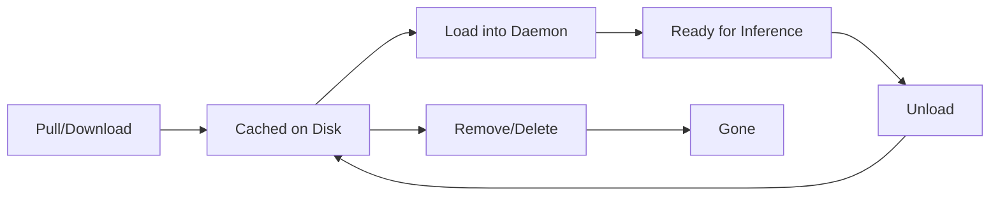

# Model Management

Mullama provides comprehensive model management through the CLI, REST API, and Web UI. This page covers all aspects of working with models -- from downloading to customization to lifecycle management.

## Pulling Models

### Using Aliases

The simplest way to get started is to pull a model using its alias. Mullama includes 40+ pre-configured aliases that map to optimized GGUF files on HuggingFace.

```bash
# Pull popular models
mullama pull llama3.2:1b        # Meta Llama 3.2 1B (~800 MB)
mullama pull qwen2.5:7b         # Qwen 2.5 7B (~4.7 GB)
mullama pull deepseek-r1:7b     # DeepSeek R1 7B (~4.9 GB)
mullama pull phi-4:14b          # Microsoft Phi-4 14B (~8.5 GB)
mullama pull mistral:7b         # Mistral 7B (~4.1 GB)
mullama pull gemma2:9b          # Google Gemma 2 9B (~5.4 GB)

# Pull embedding models
mullama pull nomic-embed         # Nomic Embed Text v1.5

# Pull vision models
mullama pull llava:7b            # LLaVA 7B (includes mmproj)
```

!!! tip "First-Time Auto-Pull"
    When you use `mullama run` or `mullama serve --model` with an alias, the model is automatically downloaded if not already cached. No explicit `pull` is required.

### HuggingFace Direct Downloads

For models not in the alias registry, use the `hf:` prefix to download directly from HuggingFace.

**Format:** `hf:<organization>/<repository>[:<filename>]`

```bash
# Auto-detect best GGUF file from a repository
mullama pull hf:bartowski/Llama-3.2-1B-Instruct-GGUF

# Download a specific GGUF file
mullama pull hf:TheBloke/Llama-2-7B-GGUF:llama-2-7b.Q4_K_M.gguf

# Download specific quantization
mullama pull hf:bartowski/Llama-3.2-3B-Instruct-GGUF:Llama-3.2-3B-Instruct-Q5_K_M.gguf

# From official model providers
mullama pull hf:Qwen/Qwen2.5-7B-Instruct-GGUF
mullama pull hf:microsoft/Phi-3-mini-4k-instruct-gguf
```

When no filename is specified, Mullama applies the following preference order to select the best available quantization:

1. `Q4_K_M` -- Best balance of quality and size (default)
2. `Q4_K_S` -- Slightly smaller than Q4_K_M
3. `Q5_K_M` -- Higher quality, larger
4. `Q4_0` -- Basic 4-bit quantization
5. `Q8_0` -- High quality 8-bit
6. `F16` -- Full 16-bit precision

### HuggingFace Model Spec Format

The full HuggingFace spec format supports several variations:

| Format | Example | Description |
|--------|---------|-------------|
| `hf:org/repo` | `hf:bartowski/Llama-3.2-1B-Instruct-GGUF` | Auto-detect best file |
| `hf:org/repo:file` | `hf:TheBloke/Llama-2-7B-GGUF:llama-2-7b.Q4_K_M.gguf` | Specific file |
| `hf:org/repo@rev` | `hf:Qwen/Qwen2.5-7B-Instruct-GGUF@a1b2c3d` | Specific revision |
| `hf:org/repo:file@rev` | `hf:Qwen/Qwen2.5-7B-Instruct-GGUF:Q4_K_M@abc123` | File at revision |

!!! info "Gated Models"
    Some HuggingFace models require acceptance of terms before downloading. Set the `HF_TOKEN` environment variable:
    ```bash
    export HF_TOKEN="hf_your_token_here"
    mullama pull hf:meta-llama/Llama-3.2-1B-Instruct-GGUF
    ```

### Download Progress

When pulling models, Mullama displays real-time progress:

```
$ mullama pull llama3.2:1b
Downloading bartowski/Llama-3.2-1B-Instruct-GGUF
  File: Llama-3.2-1B-Instruct-Q4_K_M.gguf
  [========================================>           ] 75% 612 MB / 815 MB  45.2 MB/s  ETA 4s
```

Use `--quiet` or `-q` to suppress progress output (useful for scripts):

```bash
mullama pull -q llama3.2:1b
```

---

## Listing Models

### List All Local Models

```bash
mullama list
```

**Output:**

```
NAME                                      SIZE       QUANTIZATION   MODIFIED
Llama-3.2-1B-Instruct-GGUF:Q4_K_M        0.8 GB    Q4_K_M         2 days ago
qwen2.5-7b-instruct-q4_k_m               4.7 GB    Q4_K_M         5 hours ago
deepseek-r1-7b                            4.9 GB    Q4_K_M         1 hour ago
my-custom-assistant                       0.8 GB    Q4_K_M         30 min ago

4 model(s), 11.2 GB total
```

### Verbose Listing

```bash
mullama list --verbose
```

Shows additional details including file paths and repository information.

### JSON Output

```bash
mullama list --json
```

```json
{
  "models": [
    {
      "name": "Llama-3.2-1B-Instruct-GGUF:Q4_K_M",
      "size_bytes": 858993459,
      "quantization": "Q4_K_M",
      "modified": "2025-01-21T14:30:00Z",
      "path": "/home/user/.cache/mullama/models/bartowski/Llama-3.2-1B-Instruct-GGUF/Llama-3.2-1B-Instruct-Q4_K_M.gguf",
      "repo": "bartowski/Llama-3.2-1B-Instruct-GGUF"
    }
  ],
  "total_count": 4,
  "total_size_bytes": 12025908428
}
```

---

## Showing Model Details

### Basic Details

```bash
mullama show llama3.2:1b
```

**Output:**

```
Model: llama3.2:1b
  Family:       llama
  Parameters:   1.24B
  Quantization: Q4_K_M
  Size:         0.8 GB
  Context:      131072 (max)
  Repository:   bartowski/Llama-3.2-1B-Instruct-GGUF
  Path:         ~/.cache/mullama/models/bartowski/Llama-3.2-1B-Instruct-GGUF/...
  Modified:     2025-01-20 14:30:00
  Architecture: LlamaForCausalLM
  Vocab Size:   128256
```

### Show Modelfile

For custom models created with `mullama create`:

```bash
mullama show my-assistant --modelfile
```

**Output:**

```dockerfile
FROM llama3.2:1b
PARAMETER temperature 0.7
PARAMETER num_ctx 8192
SYSTEM """
You are a helpful coding assistant specialized in Rust programming.
"""
```

### Show Parameters

```bash
mullama show my-assistant --parameters
```

**Output:**

```
Parameters:
  temperature:    0.7
  top_p:          0.9
  num_ctx:        8192
  num_predict:    1024
  repeat_penalty: 1.1
```

### Show License

```bash
mullama show llama3.2:1b --license
```

---

## Creating Custom Models

Custom models are configurations that wrap a base model with specific parameters, system prompts, and settings.

### Basic Workflow

1. Create a `Modelfile`:

    ```dockerfile
    FROM llama3.2:1b

    PARAMETER temperature 0.7
    PARAMETER num_ctx 8192

    SYSTEM """
    You are a helpful assistant that responds concisely.
    """
    ```

2. Create the model:

    ```bash
    mullama create my-assistant -f ./Modelfile
    ```

3. Use the model:

    ```bash
    mullama run my-assistant "Hello!"
    mullama serve --model my-assistant
    ```

### From Specific Files

```bash
# From a Modelfile at a specific path
mullama create coding-helper -f ./configs/coding.modelfile

# From a Mullamafile (extended format)
mullama create reasoning-model -f ./Mullamafile
```

### File Discovery

When no `-f` flag is provided, Mullama looks for files in this order:

1. `./Mullamafile`
2. `./Modelfile`

If neither exists, an error is returned.

!!! note "Auto-Download"
    By default, `mullama create` downloads the base model specified in `FROM` if it is not already cached. Use `--download=false` to disable this behavior.

See the [Modelfile Format](modelfile.md) page for complete directive reference.

---

## Copying Models

Copy a custom model to create a new version or rename:

```bash
# Copy a model
mullama cp my-assistant my-assistant-v2

# Use the copy as a starting point for modifications
mullama show my-assistant-v2 --modelfile > Modelfile
# Edit the Modelfile...
mullama create my-assistant-v3 -f Modelfile
```

!!! warning "Copies are Independent"
    Copying creates an independent model configuration. Changes to the original do not affect the copy.

---

## Removing Models

### Remove Custom Models

```bash
# With confirmation prompt
mullama rm my-old-assistant

# Force remove (no prompt)
mullama rm -f my-old-assistant
```

### Remove Cached Downloads

To remove a cached HuggingFace download:

```bash
# Remove specific repo's models
mullama cache remove bartowski/Llama-3.2-1B-Instruct-GGUF

# Remove specific file
mullama cache remove bartowski/Llama-3.2-1B-Instruct-GGUF --filename Llama-3.2-1B-Instruct-Q4_K_M.gguf

# Clear entire cache
mullama cache clear --force
```

!!! danger "Cache Clear"
    `mullama cache clear` removes ALL downloaded models. They must be re-downloaded to use again.

---

## Model Storage

### Cache Location

Downloaded models from HuggingFace are stored in platform-specific cache directories:

| Platform | Default Path |
|----------|--------------|
| Linux | `~/.cache/mullama/models/` |
| macOS | `~/Library/Caches/mullama/models/` |
| Windows | `%LOCALAPPDATA%\mullama\models\` |

Override with the `MULLAMA_CACHE_DIR` environment variable:

```bash
export MULLAMA_CACHE_DIR="/mnt/fast-ssd/models"
```

### Custom Model Storage

Custom models created with `mullama create` are stored separately:

| Platform | Default Path |
|----------|--------------|
| Linux | `~/.mullama/models/` |
| macOS | `~/.mullama/models/` |
| Windows | `%USERPROFILE%\.mullama\models\` |

Override with the `MULLAMA_MODELS_DIR` environment variable:

```bash
export MULLAMA_MODELS_DIR="/opt/mullama/models"
```

### Directory Structure

```
~/.cache/mullama/models/
  bartowski/
    Llama-3.2-1B-Instruct-GGUF/
      Llama-3.2-1B-Instruct-Q4_K_M.gguf
    DeepSeek-R1-Distill-Qwen-7B-GGUF/
      DeepSeek-R1-Distill-Qwen-7B-Q4_K_M.gguf
  Qwen/
    Qwen2.5-7B-Instruct-GGUF/
      qwen2.5-7b-instruct-q4_k_m.gguf

~/.mullama/models/
  my-assistant.json
  coding-helper.json
  reasoning-model.json
```

---

## Cache Management

### View Cache Information

```bash
# Show cache directory path
mullama cache path
# Output: /home/user/.cache/mullama/models

# Show total cache size
mullama cache size
# Output: 11.2 GB (4 models)

# List all cached models
mullama cache list

# Detailed cache listing
mullama cache show
```

### Clear Cache

```bash
# Clear with confirmation
mullama cache clear
# Are you sure you want to remove all cached models (11.2 GB)? [y/N]

# Clear without confirmation
mullama cache clear --force
```

### Selective Removal

```bash
# Remove all files from a specific repository
mullama cache remove bartowski/Llama-3.2-1B-Instruct-GGUF

# Remove a specific quantization file
mullama cache remove bartowski/Llama-3.2-1B-Instruct-GGUF \
  --filename Llama-3.2-1B-Instruct-Q4_K_M.gguf
```

---

## Searching HuggingFace

### Search for Models

```bash
# Search by name
mullama search "llama 3.2"

# Search for code models
mullama search "code instruct gguf"

# Limit results
mullama search "mistral" -n 5
```

**Output:**

```
REPOSITORY                                         DOWNLOADS    UPDATED
bartowski/Llama-3.2-1B-Instruct-GGUF               125,432      3 days ago
bartowski/Llama-3.2-3B-Instruct-GGUF                89,201      3 days ago
bartowski/Meta-Llama-3.1-8B-Instruct-GGUF          312,445      2 weeks ago

3 result(s)
```

### Show Available Files

```bash
mullama search "llama 3.2 1b" --files
```

**Output:**

```
bartowski/Llama-3.2-1B-Instruct-GGUF
  Files:
    Llama-3.2-1B-Instruct-IQ2_M.gguf         (0.4 GB)
    Llama-3.2-1B-Instruct-Q2_K.gguf          (0.5 GB)
    Llama-3.2-1B-Instruct-Q3_K_M.gguf        (0.6 GB)
    Llama-3.2-1B-Instruct-Q4_K_M.gguf        (0.8 GB)  [default]
    Llama-3.2-1B-Instruct-Q5_K_M.gguf        (0.9 GB)
    Llama-3.2-1B-Instruct-Q6_K.gguf          (1.0 GB)
    Llama-3.2-1B-Instruct-Q8_0.gguf          (1.3 GB)
    Llama-3.2-1B-Instruct-f16.gguf           (2.5 GB)
```

### Get Repository Details

```bash
mullama info bartowski/Llama-3.2-1B-Instruct-GGUF
```

---

## Loading and Unloading Models

### Loading into the Daemon

Load a model into the running daemon for inference:

```bash
# Load by alias (model must be downloaded)
mullama load llama3.2:1b

# Load with GPU acceleration
mullama load llama3.2:1b -g 35

# Load with custom context size
mullama load qwen2.5:7b -c 8192

# Load a local GGUF file with an alias
mullama load my-model:./path/to/model.gguf

# Load and set as default
mullama load llama3.2:1b --default

# Load a vision model
mullama load llava:7b --mmproj ./mmproj-model-f16.gguf
```

### Checking Loaded Models

```bash
mullama ps
```

**Output:**

```
NAME                 SIZE       GPU          CONTEXT    ACTIVE
*llama3.2:1b         1236M      35 layers    4096       -
 qwen2.5:7b          7615M      CPU          4096       2 reqs

* = default model
```

### Unloading Models

Free memory by unloading models that are no longer needed:

```bash
mullama unload qwen2.5:7b
```

!!! warning "Active Requests"
    If a model has active requests, unloading will wait for them to complete or fail with an error. Use the `--force` flag to immediately unload regardless of active requests.

---

## Model Lifecycle



### States

| State | Description | Commands |
|-------|-------------|----------|
| **Not Downloaded** | Model exists in registry but not on disk | `pull`, `search` |
| **Cached** | Downloaded to disk but not loaded | `list`, `show` |
| **Loaded** | In memory, ready for inference | `ps`, `run`, API calls |
| **Active** | Currently processing requests | `ps` (shows active count) |

### Best Practices

1. **Pre-pull models** before serving to avoid download delays:
   ```bash
   mullama pull llama3.2:1b
   mullama pull qwen2.5:7b
   mullama serve --model llama3.2:1b --model qwen2.5:7b
   ```

2. **Monitor memory** when loading multiple models:
   ```bash
   mullama ps  # Check loaded model sizes
   curl http://localhost:8080/api/system/status | jq .stats
   ```

3. **Unload unused models** to free memory for larger ones:
   ```bash
   mullama unload unused-model
   mullama load larger-model -g 35
   ```

4. **Use custom models** for consistent configurations:
   ```bash
   mullama create prod-assistant -f Modelfile
   mullama serve --model prod-assistant
   ```

---

## REST API for Model Management

All model management operations are also available through the REST API:

| Operation | CLI | REST API |
|-----------|-----|----------|
| List models | `mullama list` | `GET /api/models` |
| Pull model | `mullama pull <spec>` | `POST /api/models/pull` |
| Load model | `mullama load <spec>` | `POST /api/models/load` |
| Unload model | `mullama unload <alias>` | `POST /api/models/:name/unload` |
| Delete model | `mullama rm <name>` | `DELETE /api/models/:name` |
| Model details | `mullama show <name>` | `GET /api/models/:name` |
| System status | `mullama status` | `GET /api/system/status` |

See the [REST API](rest-api.md) page for complete endpoint documentation.
