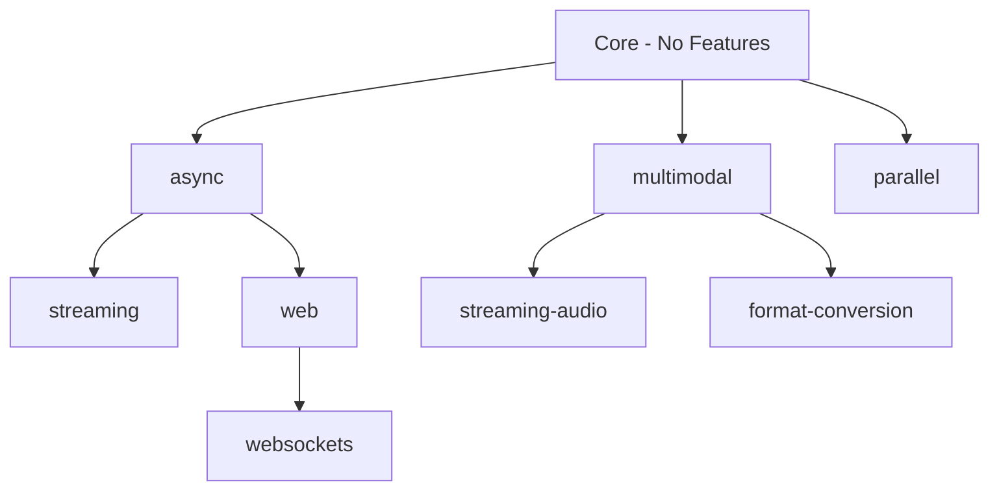

# Tutorials & Examples

Build real applications with Mullama through step-by-step tutorials. Each tutorial includes complete, runnable code in Node.js and Python (our primary bindings), with Rust examples where native access is required.

---

## Getting Started

Foundational tutorials for developers new to local LLM inference.

<div class="grid cards" markdown>

-   **Build a Chatbot**{ .lg .middle }

    ---

    :material-robot: Build a multi-turn conversational chatbot with streaming responses and conversation memory.

    **Difficulty:** Beginner | **Languages:** Node.js, Python, Rust
    **Features:** Core API, Chat Templates

    [:octicons-arrow-right-24: Start Tutorial](chatbot.md)

-   **Streaming Generation**{ .lg .middle }

    ---

    :material-lightning-bolt: Display text token-by-token as it generates. Console streaming, SSE, and WebSocket patterns.

    **Difficulty:** Beginner | **Languages:** Node.js, Python, Rust
    **Features:** Streaming, Async

    [:octicons-arrow-right-24: Start Tutorial](streaming.md)

</div>

---

## Applications

Build complete applications using Mullama as the inference engine.

<div class="grid cards" markdown>

-   **RAG Pipeline**{ .lg .middle }

    ---

    :material-database-search: Retrieval-Augmented Generation with document embeddings, vector search, and grounded answers.

    **Difficulty:** Intermediate | **Languages:** Node.js, Python, Rust
    **Features:** Embeddings, Batch

    [:octicons-arrow-right-24: Start Tutorial](rag.md)

-   **API Server**{ .lg .middle }

    ---

    :material-server: Production API server with OpenAI-compatible endpoints, streaming SSE, and rate limiting.

    **Difficulty:** Intermediate | **Languages:** Node.js (Express), Python (FastAPI)
    **Features:** Async, Streaming

    [:octicons-arrow-right-24: Start Tutorial](api-server.md)

-   **Semantic Search**{ .lg .middle }

    ---

    :material-magnify: Build a semantic search engine with embedding-based retrieval and similarity ranking.

    **Difficulty:** Intermediate | **Languages:** Node.js, Python
    **Features:** Embeddings, Batch

    [:octicons-arrow-right-24: Start Tutorial](semantic-search.md)

-   **Batch Processing**{ .lg .middle }

    ---

    :material-tray-full: Process multiple prompts efficiently with parallel execution and progress reporting.

    **Difficulty:** Intermediate | **Languages:** Node.js, Python, Rust
    **Features:** Parallel, Batch

    [:octicons-arrow-right-24: Start Tutorial](batch.md)

-   **Multimodal Processing**{ .lg .middle }

    ---

    :material-image-text: Process images alongside text for captioning, visual QA, and multi-format understanding.

    **Difficulty:** Intermediate | **Languages:** Rust (primary), Python
    **Features:** Multimodal

    [:octicons-arrow-right-24: Start Tutorial](multimodal.md)

</div>

---

## Advanced

Complex integrations requiring multiple features and deeper system knowledge.

<div class="grid cards" markdown>

-   **Voice Assistant**{ .lg .middle }

    ---

    :material-microphone: Real-time voice-to-text-to-response pipeline with VAD and streaming output.

    **Difficulty:** Advanced | **Languages:** Rust (primary)
    **Features:** Streaming Audio, Multimodal, Async

    [:octicons-arrow-right-24: Start Tutorial](voice-assistant.md)

-   **Edge Deployment**{ .lg .middle }

    ---

    :material-chip: Deploy Mullama on Raspberry Pi, Jetson Nano, and other resource-constrained devices.

    **Difficulty:** Advanced | **Languages:** Python, Bash
    **Features:** CPU Optimization, Quantization

    [:octicons-arrow-right-24: Start Tutorial](edge-deployment.md)

</div>

---

## Prerequisites

Before starting any tutorial, ensure you have:

1. **Mullama installed** for your language of choice:

    === "Node.js"
        ```bash
        npm install mullama
        ```

    === "Python"
        ```bash
        pip install mullama
        ```

    === "Rust"
        ```toml
        [dependencies]
        mullama = { version = "0.1", features = ["full"] }
        ```

2. **A GGUF model file** -- Download or pull via the daemon:
    ```bash
    mullama pull llama3.2:1b
    ```

3. **System dependencies** -- See [Platform Setup](../getting-started/platform-setup.md) for your OS.

---

## Difficulty Guide

| Level | Description | Time Estimate |
|-------|-------------|---------------|
| **Beginner** | Core API usage, minimal configuration | 15-30 minutes |
| **Intermediate** | Multiple features, application architecture | 30-60 minutes |
| **Advanced** | System integration, performance tuning, hardware-specific | 60+ minutes |

---

## Running Examples

### Using the Daemon (Simplest)

The Mullama daemon provides an OpenAI-compatible API without writing any code:

```bash
# Start the daemon with a model
mullama run llama3.2:1b "Hello, world!"

# Or start the server for API access
mullama serve --model llama3.2:1b
```

### Using Language Bindings

=== "Node.js"
    ```bash
    node chatbot.js
    ```

=== "Python"
    ```bash
    python chatbot.py
    ```

=== "Rust"
    ```bash
    cargo run --example chatbot --features full
    ```

---

## Feature Dependencies

Understanding which features each tutorial uses:



---

## What's Next

- New to Mullama? Start with [Build a Chatbot](chatbot.md)
- Want an API? Jump to [API Server](api-server.md)
- Need search? Try [Semantic Search](semantic-search.md)
- Explore [Language Bindings](../bindings/index.md) for API details
